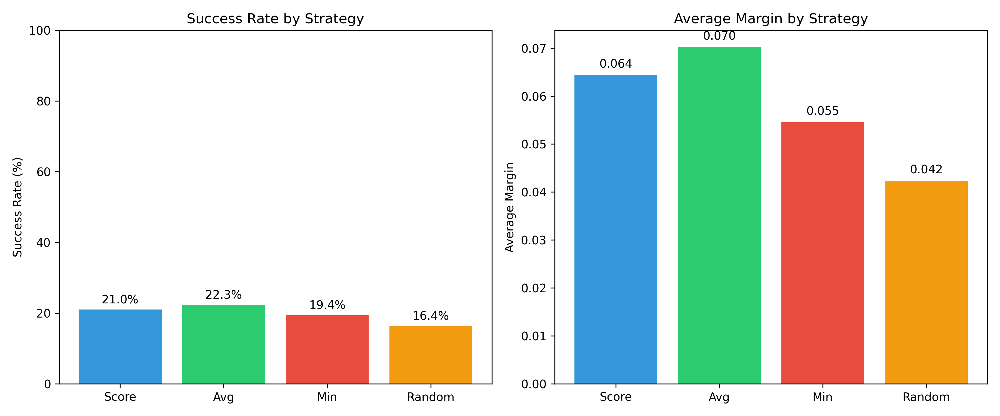
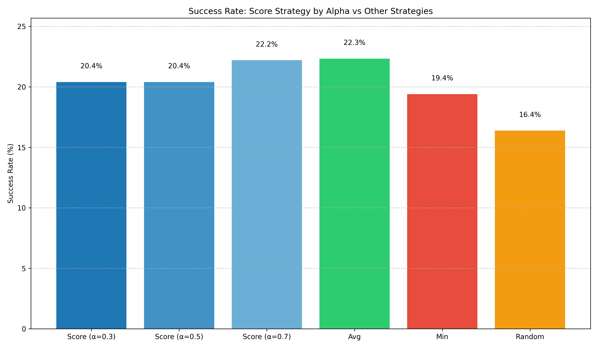
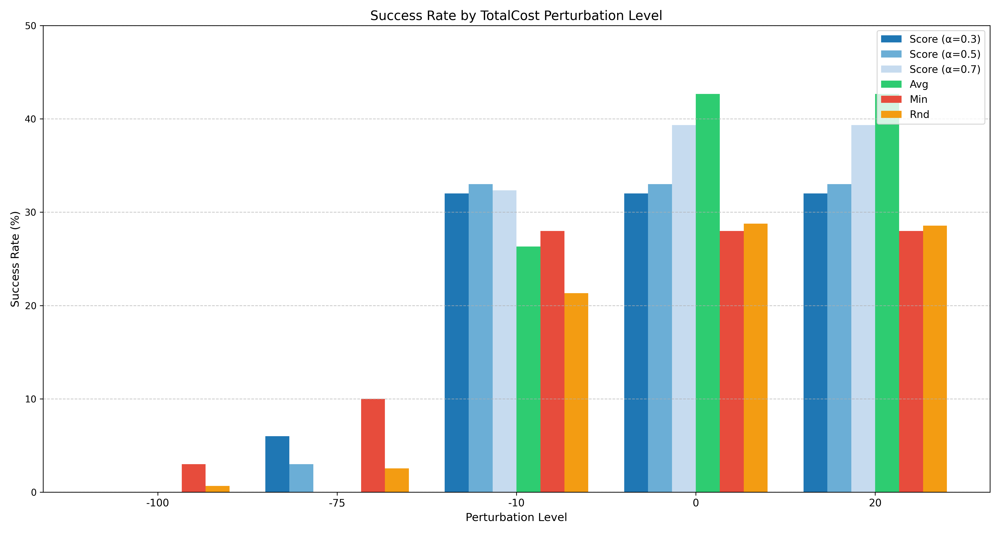
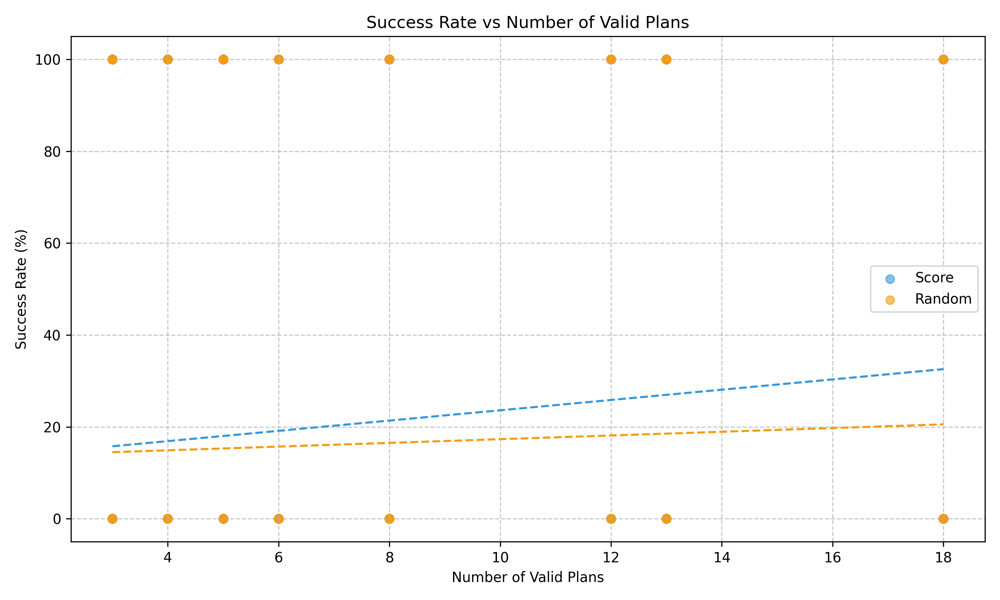

# Evaluating the Q2S (Quality to Satisfaction)

This project implements an experimental framework to evaluate the effectiveness of the Quality to Satisfaction (Q2S) matrix for plan selection in the presence of perturbations.

## Description

The Q2S matrix is a tool designed to evaluate and compare different plans based on their ability to satisfy quality objectives. For each plan-objective combination, the Q2S matrix calculates a "satisfaction distance" that represents how well the plan meets the objective.

Values in the Q2S matrix represent:
- **Positive values**: satisfaction with margin (higher is better)
- **Zero**: exact satisfaction
- **Negative values**: constraint violation

The basic formula for calculating the satisfaction distance for "max" type constraints is:
```
d_{i,j} = (MaxValue[j] - ActualValue[i,j]) / MaxValue[j]
```

The project compares different plan selection strategies:

1. **Q2S**: Combines AvgSat and MinSat according to the α parameter
2. **AvgSat**: Selects the plan with the best average distance
3. **MinSat**: Selects the plan with the best minimum distance
4. **Random**: Randomly selects a valid plan (baseline)

For plan selection, a strategy based on the Hurwicz criterion is used:
```
Score = α * AvgSat + (1-α) * MinSat
```
where:
- `AvgSat` is the average satisfaction distance for all objectives
- `MinSat` is the minimum satisfaction distance (worst case)
- `α` is a parameter that balances optimism and pessimism (typically 0.3, 0.5, or 0.7)

## The Experiment

The experimental validation of the Q2S approach was conducted through two main experiments:

### Experiment 1 - Plan Selection

In Experiment 1, we configured scenarios where most plans initially satisfied all goals, then compared different selection strategies before introducing perturbations. This experiment aimed to evaluate which strategy produces plans that remain valid even after unexpected changes in the environment.

**Independent variables** included:
- Perturbation type (which constraint changes) and intensity (low, medium, high)
- Plan selection strategy:
  - **Q2S approach**: Combines average satisfaction distance and minimum satisfaction distance with α parameter
  - **Maximum average distance (AvgSat)**: Selects the plan with the highest average distance to constraint boundaries
  - **Minimum distance (MinSat)**: Selects the plan with the lowest margin to constraint boundaries
  - **Random plan selection**: Randomly selects any plan that satisfies all constraints (baseline)

**Dependent variables** measured:
- Success rate: percentage of scenarios without constraint violations after perturbation
- Constraint margin: normalized distance to violation

### Experiment 2 - Goal Relaxation

In Experiment 2, we tightened constraints until no plan satisfied all goals and then compared different relaxation strategies. This experiment aimed to evaluate which relaxation approach produces better trade-offs when not all goals can be satisfied simultaneously.

**Independent variables** included:
- Constraint tightness (moderate, strict)
- Goal relaxation strategy:
  - **Q2S relaxation**: Uses the RelaxScore formula with fixed weighting parameters
  - **Highest priority relaxation**: Relaxes goals based on designer-defined priority values
  - **Random goal relaxation**: Randomly selects goals to relax (baseline)

**Dependent variables** measured:
- Success rate: percentage of scenarios where relaxation produced valid plans
- Violation rate: extent of constraint violations

## Experiment 1 - Results

We evaluated the Q2S approach using two case studies:

### Case Study 1: Meeting Scheduler

The Meeting Scheduler case study involves planning meetings with different parameters:
- Participants: 5-50
- Available organizers: 1-5
- Time constraints: 1-14 days
- Budget constraints: $100-$1000

Three quality objectives were defined:
- QG0: Cost ≤ threshold
- QG1: Effort ≤ threshold
- QG2: Time ≤ threshold

**Key Findings**:

The experimental results from 4,500 scenarios with the Meeting Scheduler showed:

- **Success rates** (percentage of plans that remain valid after perturbation):
  - Avg: 22.33%
  - Score: 21.00%
  - Min: 19.40%
  - Rnd: 16.38%

- **Average margins** (distance from constraints after perturbation):
  - Avg: 0.3145
  - Score: 0.3067
  - Min: 0.2812
  - Rnd: 0.2586

- **Score strategy by alpha**:
  - α=0.3: Success Rate = 20.40%, Margin = 0.0611
  - α=0.5: Success Rate = 20.40%, Margin = 0.0621
  - α=0.7: Success Rate = 22.20%, Margin = 0.0700

### Visualizations


*Strategy comparison showing success rates and average margins for different selection strategies*


*Success rates for the Score strategy with different alpha values compared to other strategies*


*Success rates for different strategies under various cost constraint perturbation levels*


*Success rate relationship with the number of valid plans available*


### Case Study 2: Cleaner Robot

The Cleaner Robot case study involves a robot with different constraints:
- Power consumption
- Cleaning precision
- Noise levels
- Time to complete tasks

**Key Findings**:

The experimental results from 45,000 scenarios with the Cleaner Robot showed:

- **Success rates** (percentage of plans that remain valid after perturbation):
  - Score: 25.49%
  - Avg: 23.17%
  - Min: 23.10%
  - Rnd: 18.60%

- **Average margins** (distance from constraints after perturbation):
  - Avg: 0.2967
  - Score: 0.2624
  - Min: 0.2381
  - Rnd: 0.2544

- **Score strategy by alpha**:
  - α=0.3: Success Rate = 24.30%, Margin = 0.0589
  - α=0.5: Success Rate = 26.16%, Margin = 0.0670
  - α=0.7: Success Rate = 26.00%, Margin = 0.0747


## Experiment Replication

This section provides instructions for replicating the experiments conducted in this project.

### Project Structure

The current project structure is as follows:

```
.
├── README.md
├── requirements.txt
├── doc.md
├── data/
│   ├── meeting_scheduler.json
│   └── cleaner_robot.json
├── meeting_scheduler_results/
│   └── visualizations/
├── cleaner_robot_results/
│   └── visualizations/
├── exp1_analyzer.py
├── exp1_log.py
├── exp1_scenario.py
├── exp1_simulator.py
├── q2s_matrix.py
├── q2s_utils.py
├── test_q2s_matrix.py
├── test_q2s_utils.py
├── test_q2s_utils_cr.py
└── test_scenario.py```

### Prerequisites

The following libraries are required:
- numpy
- pandas
- matplotlib
- seaborn

### Environment Setup

1. Create a virtual environment:
   ```
   python -m venv venv
   ```

2. Activate the virtual environment:
   - On Windows:
     ```
     venv\Scripts\activate
     ```
   - On macOS and Linux:
     ```
     source venv/bin/activate
     ```

3. Install the required packages:
   ```
   pip install -r requirements.txt
   ```

### Usage

#### Generating and Processing Scenarios

To generate and process scenarios, use the following command:
```
python exp1_scenario.py <configuration_file>
```

Examples:
```
python exp1_scenario.py data/meeting_scheduler.json
python exp1_scenario.py data/cleaner_robot.json
```

#### Analyzing Scenarios

To analyze the generated scenarios, use the following command:
```
python exp1_analyzer.py <configuration_file>
```

Examples:
```
python exp1_analyzer.py data/meeting_scheduler.json
python exp1_analyzer.py data/cleaner_robot.json
